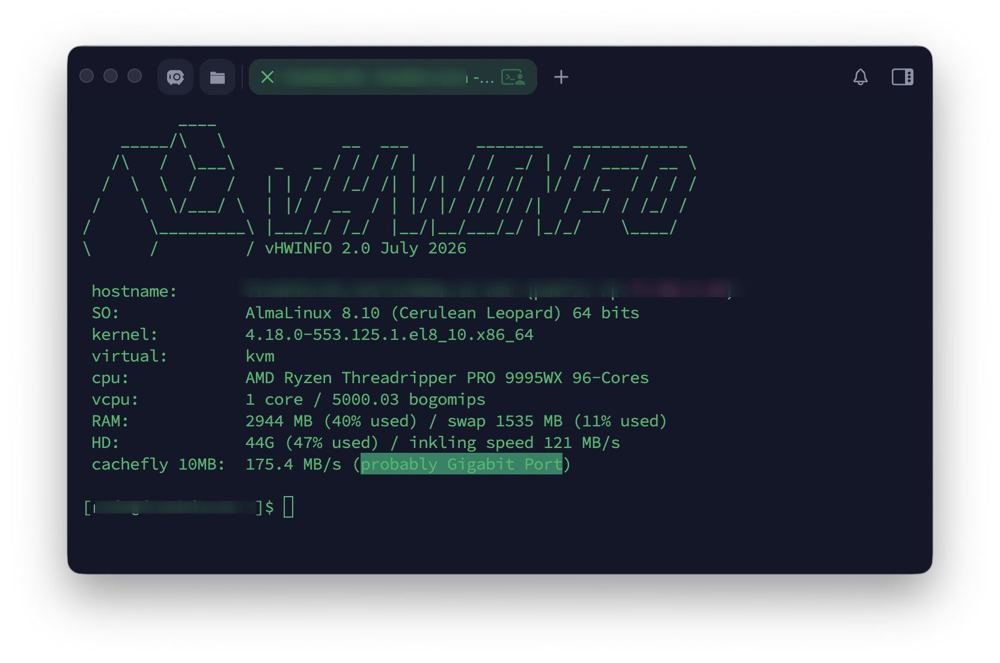

# vHWINFO

A lightweight shell script that retrieves detailed hardware and software information from a Linux server, including hostname, public/private IP address, OS details, virtualization detection, CPU, RAM, and disk usage. It also runs a quick network and disk speed test.

## Features

- Hostname and domain detection (with clean output, no stray dots)
- Public IP lookup via `api.ipify.org` (with timeout to avoid hangs)
- OS detection based on `/etc/os-release`, compatible with Debian 8–13 and most modern distros
- Virtualization detection (`systemd-detect-virt`, DMI hardware info, Microsoft VirtualPC via `dmesg`)
- CPU, RAM, and disk usage summary
- Network download speed test (via `curl`) and disk write speed test

## Usage

Download and run directly:

```bash
curl -sSL https://raw.githubusercontent.com/rafa3d/vHWINFO/refs/heads/master/vhwinfo.sh -o vhwinfo.sh && chmod +x vhwinfo.sh && ./vhwinfo.sh
```

Or run it in one line without saving:

```bash
curl -sSL https://raw.githubusercontent.com/rafa3d/vHWINFO/refs/heads/master/vhwinfo.sh | bash
```

